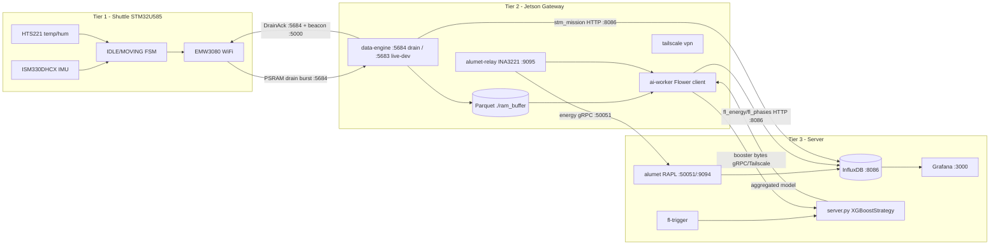

# PLUDOS — System Overview

> Single-file blueprint: a demo walkthrough and a thesis-defence reference.
> Every claim about a constant or path cites `file:line`. Where a value is not
> in the source, it is marked **TBD** or points to a deep-dive doc.
> When code and an older doc disagree, this file follows the **code** and flags
> the drift (see `docs/SYSTEM_OVERVIEW.md` companion audit, not committed here).

---

## 1. What PLUDOS is

PLUDOS is a three-tier, energy-aware federated-learning system for predictive
maintenance on Savoye XTPS warehouse shuttles. Each shuttle carries an STM32U585
edge node that captures high-rate IMU vibration into PSRAM during a mission and
**drains it in one burst over Wi-Fi UDP when the mission ends**, keeping the radio
off the rest of the time to save battery (ADR-020/021). A Jetson Orin Nano gateway
per minifloor receives each drained mission, writes Parquet, and trains a local
XGBoost anomaly model.

> **Note (ADR-021 Phase 1, 2026-06-03):** earlier revisions of this document
> describe a continuous 50 Hz live telemetry stream on :5683. That stream has been
> removed — the radio is now duty-cycled (off during MOVING/IDLE, on only to drain
> on :5684). See `sampling_strategy.md §4` and `decisions.md` ADR-021 for the
> current model; sections below that mention "50 Hz TX" describe the superseded path. A central laptop server aggregates the per-gateway
boosters via horizontal tree-set union and closes an energy-aware control loop
that adapts model size to a measured per-round energy budget. **The original and
still-primary goal is reliable data collection; the ML, federation, and
energy-adaptation layers are features built on top of that foundation.**

---

## 2. Physical context — Savoye XTPS shuttle mechanics

The physics of the shuttle is what makes the telemetry interpretable, so it is
documented first. Source: `docs/architecture.md` §"Shuttle physical model",
`docs/distance_estimation.md` §Context.

- **1D rail.** One shuttle per minifloor on a single horizontal rail; rail
  length varies per installation. The body translates strictly forward/back — no
  lateral or vertical translation.
- **Telescopic arms.** Arms extend **perpendicular** to the rail to pick/place
  boxes. Arm motion never moves the body along the rail.
- **2-deep shelves.** A back slot requires a 3–4 leg shuffle: reach front → move
  front box aside → reach back → retract. So short MOVING legs (≤2 s) are normal.
- **Elevator hand-off.** A conveyor belt at one rail end carries boxes between
  floors; the shuttle stays on its own floor.

Three consequences drive the design:

| Physical fact | System consequence |
|---|---|
| `state==IDLE` ⇒ body physically stopped | ZUPT (`vel=0` at every IDLE packet) is an **exact** constraint, not a heuristic (`data-engine.py:404-426`) |
| Arm vibration is on the non-rail axis | Variance-based track-axis auto-detect rejects it for free (`data-engine.py:385-392`) |
| Short MOVING legs dominate | Distance estimator accepts ~25–35% underestimation on <2 s runs (`docs/distance_estimation.md` §Expected accuracy) |

---

## 3. System diagram

### ASCII

```
TIER 1 — EDGE (per shuttle)            TIER 2 — GATEWAY (per minifloor)        TIER 3 — SERVER (laptop)
┌───────────────────────────┐         ┌───────────────────────────────────┐  ┌──────────────────────────────┐
│ STM32U585 (B-U585I-IOT02A) │         │ Jetson Orin Nano (Podman compose) │  │ Podman compose + Flower proc │
│  ISM330DHCX IMU (I2C2)     │         │                                   │  │                              │
│  HTS221 temp/hum (I2C2)    │  UDP    │  data-engine  :5683 live (dev/mock)│  │  influxdb        :8086       │
│  LPS22HH (local debug only)│ drain   │   └─ Parquet → ./ram_buffer       │  │  grafana         :3000       │
│  EMW3080 Wi-Fi (SPI2)      │  burst  │  drain_recv   :5684 reassemble    │  │  alumet (RAPL)   :50051/:9094│
│                            │ ───────▶│  beacon       :5000 broadcast     │  │  fl-trigger → flwr run .     │
│  FSM: IDLE 12.5Hz snapshot │  :5684  │                                   │  │  server.py  ServerApp        │
│       MOVING → PSRAM ring  │◀────────│   AlumetProfiler 10 Hz scrape     │  │   XGBoostStrategy tree-union │
│  (beacon listen :5000)     │ beacon  │  alumet-relay INA3221→:9095 Prom  │  │                              │
└───────────────────────────┘         │  tailscale (vpn profile)          │  └──────────────────────────────┘
                                       └───────────────────────────────────┘
        STM↔GW: local Wi-Fi              GW energy: gRPC :50051 ──────────▶  server alumet (Phase 2)
                                         GW↔Server FL: gRPC over Tailscale ▶  Flower SuperLink
                                         GW→InfluxDB: HTTP :8086 ──────────▶  fl_energy / fl_phases / stm_mission / stm_idle_wave
```

### Mermaid



---

## 4. What data is collected — three tiers of trust

Data splits into three confidence tiers. This separation matters: the project's
primary deliverable is **Tier A** (raw measurement). Tier B are deterministic
functions of Tier A and are trustworthy. Tier C are integration- or
assumption-based quantities that can be materially wrong and are **under review
for removal** — they must never be presented as ground truth.

Sources: `docs/wire_protocol.md` §1, `docs/state_machine.md`, `main.c` defines,
`data-engine.py` `_compute_derived` (`:331-515`) and `_PARQUET_COLS` (`:198-234`).

### 4.A Primary — measured on the STM32 and transmitted (raw, trustworthy)

These are read directly from the sensors and carried on the wire. They are the
foundation; everything else is computed from them on the gateway.

| Signal | Sensor / origin | Internal rate | TX rate (over UDP) | Purpose |
|---|---|---|---|---|
| `accel_x/y/z` | ISM330DHCX accel, ±2 g | ODR 104 Hz, LPF2 cutoff ≈10.4 Hz (`main.c` CTRL1_XL=0x42, CTRL8_XL=0x20); polled 50 Hz | 50 Hz MOVING / 0.1 Hz IDLE | Ride-roughness vibration + impacts; FSM trigger |
| `gyro_x/y/z` | ISM330DHCX gyro, ±250 dps | ODR 104 Hz (`main.c` CTRL2_G=0x40); polled 50 Hz | same | Torsional vibration (`gyro_x/y`), yaw/turns (`gyro_z`) |
| `temp_c` | HTS221 | cached 2 Hz (`ENV_READ_PERIOD_MS=500U`, `main.c:128`) | stamped on every packet | Ambient / motor-heat proxy |
| `humidity_pct` | HTS221 | cached 2 Hz | every packet | Environmental envelope |
| `state` | STM32 FSM | evaluated 50 Hz (MOVING) | every packet | Mission segmentation, ZUPT gating |
| `seq`, `tick_ms` | STM32 | per packet | every packet | Sort key + NTP anchor |
| `pressure_hpa` | LPS22HH | local read | **not transmitted** | UART debug only (ADR-015) |

**Honest capture framing.** ODR is 104 Hz with an on-chip LPF2 cutoff ≈10.4 Hz,
and the gateway sees packets at 50 Hz MOVING, so the **observable band is ~0–10 Hz**
(25 Hz Nyquist, but LPF2 is the binding limit) and alias-free. PLUDOS captures
low-frequency ride-roughness and impact events — **not** bearing spectral signatures
(50–500 Hz, filtered out). The thesis claim is "anomaly detection from ride-quality
degradation", not "bearing frequency analysis".

The 24-byte wire struct (`<BHIBhhhhhhhh`, `data-engine.py:242`) uses int16 scaled
integers; `0x7FFF` in any sensor field = unavailable → NaN at the gateway
(`data-engine.py:593-598`). Full byte layout: `docs/wire_protocol.md` §1.

### 4.B Derived features — computed at train time, not stored (schema v4)

As of schema v4 the gateway stores **raw signal only** (the Tier-A columns
above plus `seq_gap` and `state`). All feature engineering moved to train
time in `anomaly.py:_derive_features()`, run once per FL round after the
recent Parquet files are loaded. These are pure functions of the raw axes —
no integration, no calibration constant, no axis guess — so they are as
trustworthy as the Tier-A data they are built from.

| Column | Origin | Why it is reliable |
|---|---|---|
| `accel_mag`, `gyro_mag` | `√(x²+y²+z²)` (`anomaly.py:_derive_features`) | Pure per-packet vector magnitude |
| `rolling_accel_std_10` | 10-packet rolling std of `accel_mag` (`anomaly.py:_derive_features`) | Trailing context / surface-roughness proxy |

The CNN labeller (`anomaly_cnn.py`) ignores these and consumes the raw axes
directly; IsolationForest and XGBoost use them. Earlier schema versions also
computed `accel_jerk`, `gyro_jerk`, `horizontal_accel`, `tilt_angle_deg` and
`rolling_accel_mean_10` at flush — these are no longer computed anywhere.
Recompute downstream from the raw axes if a future model needs them.

### 4.C Removed columns (gateway no longer computes or stores these)

These relied on integration, axis auto-detection, or hardcoded constants and
could be materially wrong. They were **deleted from the data-engine** in
schema v4 — not just dropped from storage but removed from computation, to
save Jetson CPU. Recompute downstream from raw signal if ever needed; never
present any as measured ground truth.

| Column | Why it was removed |
|---|---|
| `distance_m_cum` / `displacement_m` / `speed_ms` | 1D-ZUPT integration with track-axis guess and velocity noise floor; drifted badly at 10 Hz (a <1 m move once read as 32 m). Untrustworthy. |
| `mission_elapsed_s` | Target-leakage risk; the mission boundary is a 30 s-IDLE heuristic that can split or merge real missions. |
| `energy_j` (shuttle) | Never measured — `POWER_IDLE_MW`/`POWER_MOVING_MW` × elapsed, a hardcoded placeholder. Real energy is Jetson/server-side only (Alumet, `fl_phases`). |
| segmentation (`moving_run_id`, `pause_duration_s`, `moving_run_dur_s`, `pause_count`, `is_long_pause`) | Derivable from `state` transitions at analysis time; not worth a per-flush two-pass scan on the gateway. |

---

## 5. Pipeline walkthrough — STM32 wake to global model update

1. **Shuttle boots, discovers gateway.** STM32 listens for `PLUDOS-GW:<ip>[:csv-ids]`
   beacon on UDP 5000; bonds only if its `SHUTTLE_ID` is in the list
   (`docs/architecture.md` §Tier 1). Gateway broadcasts the beacon
   (`data-engine.py` `BEACON_PORT=5000`, `:148`).
2. **FSM gates capture, not a live TX rate (ADR-021).** Crossing
   `MOVEMENT_THRESHOLD_G2=0.06f` (`main.c:123`) continuously for `MOVEMENT_DWELL_MS=500U`
   (`main.c:124`) → MOVING; the IMU streams accel 3332 Hz / gyro 416 Hz into the
   PSRAM ring via FIFO while the radio stays off. Exit MOVING after
   `NO_MOVEMENT_TIMEOUT_MS=20000U` (`main.c:126`) with no above-threshold sample.
   IDLE takes a 10 s snapshot at 12.5 Hz every 10 min (`CAP_IDLE_SNAP_*`,
   `main.c:241-242`). The earlier continuous 50 Hz live `:5683` stream is gone —
   `NETWORK_SendTelemetry()` is defined but no longer called (`docs/state_machine.md`).
3. **Drain, not live send.** When the mission seals, the radio powers on and the
   PSRAM ring is drained as a UDP burst to `<gateway>:5684` (`PLDR` frames:
   DRAIN_BEGIN ×3, DRAIN_CHUNK …, DRAIN_END ×3). The shuttle waits for the gateway's
   8-byte `DrainAck` (type 6 liveness echo, delivery evidence — not ARQ) before
   blasting; on silence it skips rather than waste radio energy
   (`docs/wire_protocol.md`, `client/drain_receiver.py`).
   > **Steps 4–9 describe the live `:5683` ingest path.** Under ADR-021 the
   > firmware no longer transmits live telemetry, so on real hardware this path
   > carries only mock traffic (`tools/mock_stm32.py`); production data arrives via
   > the `:5684` drain receiver (`drain_receiver.py` → `cap_accel_*`/`cap_gyro_*`
   > Parquet + `stm_mission`/`stm_idle_wave` Influx). The live path is kept for the
   > sim/dev loop and is byte-compatible with the same `PludosTelemetry` v3 struct.

4. **Gateway ingest.** `TelemetryProtocol.datagram_received` (`data-engine.py`)
   validates size, unpacks, applies the `SHUTTLE_GROUP` ingress filter,
   and resolves a human name.
5. **Temporal anchor.** First packet per shuttle sets `offset = receipt_ms − tick_ms`
   (`data-engine.py:707`); refreshed every `NTP_REFRESH_INTERVAL=100` packets or
   `NTP_REFRESH_MAX_S=60` s (`.env.example:62-63`). Sort key is `seq`, not
   timestamp (ADR-009).
6. **Buffer.** Per-shuttle in-memory list keyed by name; raw samples only,
   no per-packet derivation. A wall-clock age cap (`BUFFER_MAX_AGE_S`, default
   300 s) force-flushes any buffer left open too long.
7. **Mission-end detection.** When a shuttle stays IDLE ≥ `MISSION_END_IDLE_S=30`
   after a MOVING run, the buffer is flushed. Soft/hard/gateway buffer-pressure
   limits and the time cap also flush (`docs/parquet_schema.md` §Flush triggers).
8. **Finalize + write Parquet.** `_finalize` casts the 13 raw columns to compact
   dtypes (float16 sensors, int8/int16/int32 identity) and `_flush` writes one
   zstd Parquet file atomically via `os.replace`. No derived columns — feature
   engineering happens later in `anomaly.py` at train time.
9. **Mission summary → InfluxDB.** On hardware the drain receiver's
   `_write_drain_summary` pushes `stm_mission` (`source="drain"`: chunk counts,
   loss_pct, accel/gyro stats) and, for idle snapshots, `stm_idle_wave`. The
   live-path `_write_mission_summary` (`packets`, `duration_ms`, no `source` tag)
   is the dormant dev-only writer. Both are skipped in `headless` mode.
10. **FL round trigger.** `fl-trigger` polls InfluxDB and launches `flwr run .`
    when ≥ `FL_MIN_FIT_CLIENTS` gateways are ready (`server/compose.yaml:95-121`).
11. **Local training.** `ai-worker` (`client.py`) loads the most recent
    `MAX_PARQUET_FILES` (default 20), labels anomalies (1D-CNN autoencoder by
    default, IsolationForest as fallback), trains XGBoost; `AlumetProfiler` writes 10 Hz `fl_energy` and
    per-phase `fl_phases` during the fit (`docs/architecture.md` §Energy profiling).
12. **Aggregation.** Server `XGBoostStrategy.aggregate_fit` (`server.py:209-268`)
    decodes booster bytes, merges via `_merge_boosters` tree-set union
    (`server.py:163-199`), validates, persists `latest.ubj`, broadcasts.
13. **Energy-aware adaptation.** `fit_config` (`server.py:275-319`) queries the
    previous round's peak energy and adapts `n_estimators` (−2 over budget,
    +1 under 60%) toward `FL_ENERGY_BUDGET_J=200.0` (`server.py:70`).

---

## 6. Container map

Client tree (`client/compose.yaml`) and server tree (`server/compose.yaml`).
`network_mode: host` is used on the Jetson to bypass the rootless-Podman CNI
firewall mismatch and to let the beacon reach the local subnet.

| Container | Tree | Role | network_mode | Profile | depends_on | Healthcheck |
|---|---|---|---|---|---|---|
| `data-engine` | client | UDP ingest + Parquet flush + beacon | host | none (all modes) | — | none |
| `ai-worker` | client | Flower XGBoost client / standalone loop | host | `vpn`, `standalone` | data-engine (started), alumet-relay (healthy) | none |
| `alumet-relay` | client | INA3221 → Prometheus :9095 + CSV | host | none (all modes) | — | `wget :9095/metrics`, 10 s |
| `tailscale` | client | Tailnet join | (default, /dev/net/tun) | `vpn` | — | none |
| `influxdb-local` | client | Local TSDB (standalone) | bridge :8086 | `standalone` | — | none |
| `grafana-local` | client | Local dashboards (standalone) | bridge :3000 | `standalone` | influxdb-local | none |
| `influxdb` | server | TSDB for fl_energy/fl_phases/stm_mission | bridge :8086 | — | — | `curl /health`, 10 s |
| `grafana` | server | Energy dashboards | bridge :3000 | — | influxdb (healthy) | none |
| `alumet` | server | RAPL profiler + relay-server :50051 + Prom :9094 | bridge | — | influxdb (healthy) | none |
| `fl-trigger` | server | Auto-launch `flwr run .` | bridge | — | influxdb (healthy) | none |

The **federated** profile runs 4 client containers (data-engine, ai-worker,
alumet-relay, tailscale) + 4 server containers (influxdb, grafana, alumet,
fl-trigger). `influxdb-local`/`grafana-local` exist only under the `standalone`
profile. The Flower `server.py` ServerApp is a separate process started by
`fl-trigger`, not a container.

---

## 7. Energy measurement — Alumet end-to-end

Sources: `docs/architecture.md` §"alumet-relay sidecar", ADR-011, `docs/ANALYTICS.md`.

```
INA3221 rails (VDD_IN, VDD_CPU_GPU_CV, VDD_SOC)
        │  alumet-agent (Rust) jetson plugin
        ▼
prometheus-exporter  localhost:9095/metrics   ── + csv (alumet_readings.csv)
        │  AlumetProfiler._read_alumet_prometheus() scrape @ 10 Hz during fit
        ▼
InfluxDB (bucket alumet_energy)
   fl_energy   — 10 Hz power samples, tags device/fl_round/nvpmodel
   fl_phases   — per-phase summary (load/train/round_total): duration_ms/energy_j/avg_power_w
        │
        ▼
Grafana (Flux queries, docs/ANALYTICS.md §4)   +   server.py reads fl_phases → adapts n_estimators
```

- **Jetson energy is REAL.** `alumet-agent` reads the on-module INA3221; channels
  confirmed `VDD_IN`, `VDD_CPU_GPU_CV`, `VDD_SOC` (ADR-011). `_read_tegrastats()`
  is the fallback if the Prometheus endpoint is unreachable.
- **Server energy is REAL.** Intel RAPL via `/sys/class/powercap`, `device=server`,
  same `fl_energy` measurement (`server/compose.yaml:61-90`).
- **Boot gate.** With `ENERGY_SOURCE_REQUIRED=alumet` (`.env.example:165`) an FL
  round aborts if the scrape fails or returns 0 — no silent degradation.
- **⚠ Shuttle energy is no longer estimated at all (schema v4).** The old
  hardcoded `POWER_IDLE_MW`/`POWER_MOVING_MW` × elapsed placeholder was removed;
  `stm_mission` now carries only `packets` and `duration_ms`. There is no
  shuttle energy figure pending a real INA3221/shunt on the STM32. Only Jetson
  and server energy are instrument-grade.

---

## 8. ML choices in one page

| Choice | Why (rationale, not math) |
|---|---|
| **XGBoost** | Vibration features are tabular and small per gateway; XGBoost is interpretable, fast, GPU-capable, and cheap to train — fits the energy-aware goal far better than a deep net (ADR-005). Uses all numeric Parquet columns as features (`docs/parquet_schema.md` is stale on this — see audit). |
| **1D-CNN autoencoder** | **Default** anomaly labeller for MOVING windows (`anomaly_cnn.py`, `ANOMALY_MODEL=cnn_autoencoder`). Bearing/ride faults are local frequency content, not long-range sequences, so a small conv autoencoder (~6 K params) beats the retired LSTM on Jetson CPU (`anomaly_cnn.py:1-13`). Falls back to IsolationForest below `CNN_MIN_MOVING_SAMPLES=200` or if torch is unavailable. |
| **Welford freeze** | Per-batch normalization leaks across FL rounds and biases reconstruction error. Welford running stats are persisted (`cnn_feature_stats.npz`), updated until `CNN_FEATURE_STATS_FREEZE=10000` window-samples, then frozen so the threshold stays comparable across rounds (`anomaly_cnn.py:159-175`). |
| **IDLE-baseline threshold** | Anomaly cut = `mean(idle_loss) + ANOMALY_K·std(idle_loss)` (`anomaly_cnn.py:257`), `K=3.0`. Using IDLE (known-good, stopped) windows as the baseline avoids the self-fulfilling "label the top X% anomalous" trap. |
| **Tree-set union** | ADR-010 Option A: concatenate every client's trees, re-sequence IDs, validate, broadcast (`server.py:163-199`). Simple, lossless, no server-side labelled data needed. Single-gateway rounds pass through unchanged; multi-gateway end-to-end test pending. |

---

## 9. Deployment modes

Set `PLUDOS_MODE` in `client/.env`; select the matching Compose profile
(ADR-018, `docs/architecture.md` §Deployment Modes).

| Mode | `PLUDOS_MODE` | Compose profile | What runs | What's lost |
|---|---|---|---|---|
| Federated | `federated` (default) | `--profile vpn` | data-engine, ai-worker (Flower), alumet-relay, tailscale | — |
| Standalone | `standalone` | `--profile standalone` | data-engine, ai-worker (local retrain loop), alumet-relay, influxdb-local, grafana-local | cross-shuttle federation, central dashboard |
| Headless | `headless` | *(no profile)* | data-engine, alumet-relay | AI inference, InfluxDB writes, Flower |

- **Federated** — registers with the central SuperLink, joins XGBoost FL rounds,
  energy flows to the server InfluxDB. Requires Tailscale (`TS_AUTHKEY`).
- **Standalone** — `client.py _run_standalone_loop()` retrains every
  `STANDALONE_RETRAIN_INTERVAL_S` (default 1800 s) on buffered Parquet, persists
  `ram_buffer/model/latest.ubj`, writes to a local InfluxDB on `localhost:8086`.
- **Headless** — pure datalogging; `_write_mission_summary` is gated off
  (`data-engine.py:656`). Parquet still accumulates on the bind-mount.

Switching modes is `.env` + `--profile` only; no image rebuild.

---

## 10. Where to look next

| Topic | Deep-dive doc |
|---|---|
| Three-tier responsibilities, failure modes, novelty assessment | `docs/architecture.md` |
| Exact 24-byte struct, sample rates, sentinel, reliability rules | `docs/wire_protocol.md` |
| STM32 FSM thresholds, debounce, env caching | `docs/state_machine.md` |
| Every Parquet column and dtype (⚠ stale — see audit) | `docs/parquet_schema.md` |
| 1D-ZUPT distance algorithm, accuracy envelope, limits | `docs/distance_estimation.md` |
| All ADRs (federation, Alumet, distance, deployment modes) | `docs/decisions.md` |
| InfluxDB measurements + Grafana Flux queries | `docs/ANALYTICS.md` |
| Gateway tunables | `client/.env.example` |
| Container topology + profiles + healthchecks | `client/compose.yaml`, `server/compose.yaml` |
| Gateway ingest/flush/distance/summary code | `client/data-engine.py` |
| CNN-AE architecture + Welford freeze | `client/anomaly_cnn.py` |
| Tree-set union aggregation + energy adaptation | `server/server.py` |
| Domain terms | `docs/glossary.md` |
| Open backlog (P0/P1/P2) | `docs/current_problems.md`, `docs/next_steps.md` |
